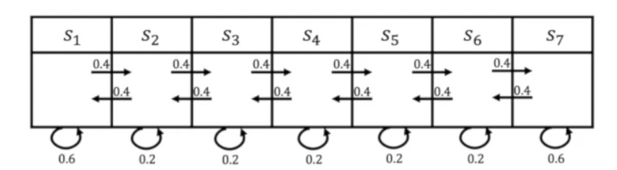

## Lecture 02 Decision Making in MDP

> Links: 视频 [link](https://space.bilibili.com/511221970/channel/detail?cid=105354) 课件 [link](https://github.com/zhoubolei/introRL/blob/master/lecture2.pdf)

#### Markov Property

未来的转移和过去是独立的，只取决于现在的状态。

#### Markov Chain



对应于Markov Chain存在一个转移矩阵$P$。

#### Markov Reward Process (MRP)

有限状态的情况下，Reward可以作为一个向量，$R = [5, 0, 0, 0, 0, 0, 10]$ 。

##### 1. Horizon

a. 整个轨迹（游戏环节）由有限个步数决定；

b. 步数有限时称作 finite Markov (reward) Process，步数也可以是无限的。

##### 2. Return

对于步骤 t 到 horizon，对rewards进行折扣，获得的收益：
$$
G_t = R_{t+1} + \gamma R_{t+2} + \gamma^2 R_{t+3} + \ldots + \gamma^{T-t-1} R_{T}\ (0 \le \gamma \le 1)
$$


##### 3. State value function $V_t(s)$

即在步骤 t 时的状态下，可能获得多大的价值
$$
V_t(s) = \mathbb{E}[G_t | s_t = s] \\
			 = \mathbb{E}[R_{t+1} + \gamma R_{t+2} + \gamma^2 R_{t+3} + \ldots + \gamma^{T-t-1} R_{T} | s_t = s]
$$


#### Computing the Value of a Markov Reward Process

**Bellman equation**
$$
V(s) = R(s) + \gamma \sum_{s' \in S} P(s'|s)V(s')
$$
其中$s'$表示下一状态。

**Matrix Form:**

$V = R + \gamma PV$, 存在$N$个状态，其中$V$为$N$个状态对应的value（$N*1$向量），P为状态转移矩阵（$N * N$矩阵），$R$为$N$个状态对应的return（$N*1$向量）。


**Value求解方法:**

1. Analytic solution

   $V = R + \gamma PV \rightarrow V = (1 - \gamma P)^{-1}R$

2. Iterative methods

   a. Dynamic Programming

   ```
   1 for all states s in S, V'(s) ← 0, V(s) ← infinity
   2 while || V - V’ || > epsilon do
   3 	V ← V‘
   4   For all state s in S, V'(s) = Bellman equation
   5 end while
   6 return V'(s) for all s in S
   ```

   b. Monte-Carlo evaluation

   ​	采样大量轨迹，分别计算Return，用平均值作为特定状态的价值。

   c. Temporal-Difference learning


### Markov Decision Process (MDP)

相比较于MRP过程，MDP$(S, A, P, R, \gamma)$多了一个决策过程（action）。

Definition: 

1. $S$ is a finite set of states；
2. $A$ is a finite set of actions；
3. $P^a$ is dynamics/transition model for each action, $P(s_{t+1} = S'|s_t = s. a_t = a)$, 即下一个状态依赖于当前状态和当前的行为；
4. R is a reward (value) function, $R(s_t = s, a_t = a) = \mathbb{E}[r_t | s_t = s, a_t = a]$；
5. Discount factor: $0 \le \gamma \le 1$。


#### Policy in MDP

Definition: 

1. Policy用来表示在某个状态的时候应该采取怎么样的行为
2. 在给定状态时，定义一个行为的分布
3. Policy: $\pi (a|s) = P(a_t =a | s_t = s)$
4. Policy应该是静态，不随时间改变的


在给定MDP和policy $\pi$ 的情况下，MDP可以向MRP转化
$$
P^{\pi}(s'|s) = \sum_{a \in A} \pi(a|s) P(s'|s, a)\\
R^{\pi}(s) = \sum_{a \in A} \pi(a|s) R(s,a)
$$
Value function

1. The state-value function $v^{\pi}(s)$  of an MDP is the expected return starting from the state $s$, and the following policy $\pi$, 期望是基于policy的，policy决定过后，基于policy来进行采样，决定一个期望。
   $$
   v^{\pi}(s) = \mathbb{E}_{\pi}[G_t | s_t = s]
   $$

2. The action-value function $q^{\pi}(s,a)$  is the expected return starting from state $s$, taking action $a$, and then following policy $\pi$
   $$
   q^{\pi}(s,a) = \mathbb{E}_{\pi}[G_t | s_t = s, a_t = a]
   $$

3. So we have,
   $$
   v^{\pi}(s) = \sum_{a \in A} \pi(a|s)q^{\pi}(s,a)
   $$

**Bellman Expectation Equation**
$$
V^\pi(s) = E_\pi [R_{t+1} + \gamma v^\pi (s_t+1)|s_t=s]
$$


---

#### Decision Making

a. Policy evaluation

b. Optimal Value Function

MDP control的两种常用算法为Policy Iteration和Value Iteration。

**Policy Iteration** 

a. update value function
$$
v_{k+1} = E_{s'}[r(s, a)+\gamma v_{k}(s')]
$$


b. update policy
$$
a = {argmax}_a E_{s'}[r(s, a) + \gamma v_{k}(s')]
$$
a,b步骤往复直至收敛。

**Value Iteration**
$$
v_{k+1}(s) = \max_a E_{s'} [r(s, a) + \gamma v_{k}(s')]
$$
迭代直至收敛。


---

## Question

Q1: 为什么Value Iteration能够Work？


